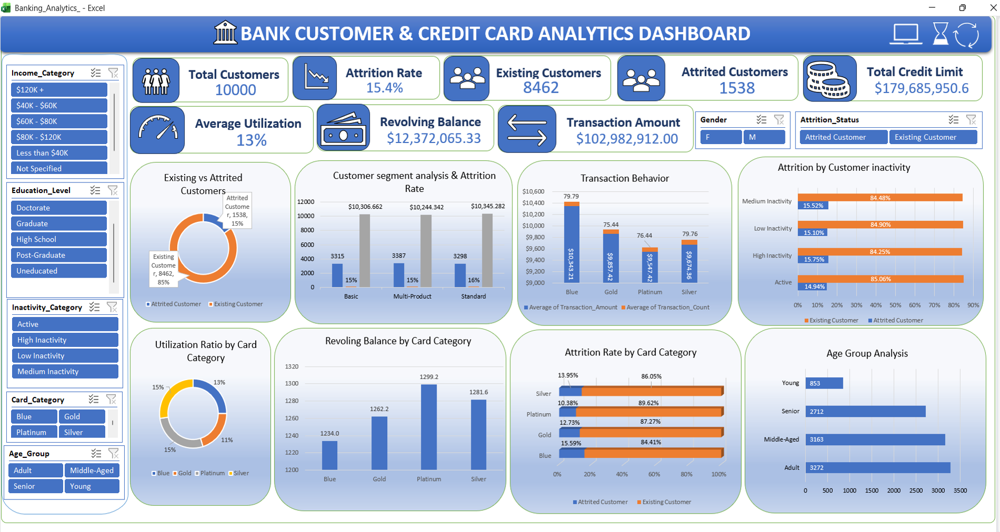

# 🏦 Bank Customer & Credit Card Analytics Dashboard

## 📌 About the Project

I created this project using **Microsoft Excel 2021** to analyze customer and credit card data from a banking dataset.

The main goal of this project is to understand customer attrition, credit usage, transaction activity, and customer segments.

I worked with the raw dataset, cleaned and prepared the data, created calculated columns and KPIs, and built an interactive dashboard using PivotTables, PivotCharts, and slicers.

This project helped me practice the complete data analysis process, from data preparation to dashboard development and business insights.

## 🎯 Project Objectives

- Analyze existing and attrited customers
- Calculate customer attrition rate
- Study attrition across card categories
- Analyze customer inactivity and transaction behavior
- Understand credit limits and credit utilization
- Analyze customer distribution by age group
- Create customer segments based on product count
- Build an interactive Excel dashboard
- Check the accuracy of formulas and calculations
- Document business insights from the data

## 🛠️ Tools Used

| Tool | Purpose |
|---|---|
| Microsoft Excel 2021 | Data analysis and dashboard creation |
| Power Query | Data cleaning and preparation |
| Excel Tables | Organizing the dataset |
| Excel Formulas | Calculations and KPI development |
| PivotTables | Summarizing data |
| PivotCharts | Creating charts |
| Slicers | Interactive filtering |
| Data Validation | Checking data |
| Conditional Formatting | Highlighting values |
| VBA Macros | Automating selected tasks |

## 📂 Dataset

I used the **Credit Card Churn Dataset** from Kaggle.

The dataset contains information about customer demographics, credit cards, account details, transaction activity, and customer attrition.

Some of the columns include:

- Customer ID
- Attrition status
- Age
- Gender
- Education level
- Marital status
- Income category
- Card category
- Months on book
- Total relationship count
- Months inactive
- Credit limit
- Revolving balance
- Average utilization ratio
- Transaction amount
- Transaction count

**Dataset Source:**  
[Kaggle – Credit Card Churn Dataset](https://www.kaggle.com/datasets/kunalgp/credit-card-churn?resource=download)

## 🧹 Data Cleaning and Preparation

During the data preparation process, I:

- Reviewed the original dataset
- Renamed selected columns to make them easier to understand
- Converted the data into an Excel Table named `tblBank`
- Created calculated columns
- Checked missing values
- Checked duplicate customer IDs
- Reviewed numeric columns
- Created categories for age, inactivity, utilization, and transaction activity
- Prepared the data for PivotTable analysis

## 🧮 Calculated Columns

I created the following calculated columns:

| Column | Purpose |
|---|---|
| `Churn_Flag` | Identifies attrited customers |
| `Available_Credit` | Credit limit minus revolving balance |
| `Calculated_Utilization` | Calculates credit utilization |
| `Utilization_Category` | Groups customers by utilization |
| `Age_Group` | Groups customers by age |
| `Inactivity_Category` | Groups customers by inactivity |
| `Transaction_Activity` | Groups customers by transaction count |
| `Customer_Segment` | Groups customers based on relationship and product count |

### Example Formulas

**Churn Flag**

```excel
=--([@Attrition_Status]="Attrited Customer")
```

**Available Credit**

```excel
=[@Credit_Limit]-[@Revolving_Balance]
```

**Calculated Utilization**

```excel
=IFERROR([@Revolving_Balance]/[@Credit_Limit],0)
```

## 📊 KPIs Included

The dashboard includes the following KPIs:

- Total Customers
- Existing Customers
- Attrited Customers
- Attrition Rate
- Total Credit Limit
- Total Revolving Balance
- Average Credit Utilization
- Total Transaction Amount
- Average Transaction Amount
- Average Transaction Count
- High Inactivity Customers

### Attrition Rate Formula

```excel
=IFERROR(
COUNTIF(tblBank[Attrition_Status],"Attrited Customer")
/COUNTA(tblBank[Customer_ID]),
0
)
```

This formula calculates the observed attrition rate in the dataset.

## 📈 Analysis I Performed

### 1. Customer Attrition Analysis

I compared existing and attrited customers using PivotTables and charts.

### 2. Attrition by Card Category

I analyzed customer attrition across different card categories.

### 3. Attrition by Inactivity

I compared observed attrition across different inactivity groups.

### 4. Credit Utilization Analysis

I reviewed credit utilization and revolving balances across card categories.

### 5. Age Group Analysis

I analyzed customer distribution and observed attrition across different age groups.

### 6. Transaction Behavior

I compared transaction amounts and transaction counts across customer groups.

### 7. Customer Segmentation

I grouped customers based on their relationship and product count.

## 📊 PivotTable Analysis

I created PivotTables for:

1. Customer Attrition Summary
2. Attrition by Card Category
3. Attrition by Inactivity Category
4. Credit Utilization by Card Category
5. Age Group Analysis
6. Transaction Behavior
7. Customer Segment Analysis

These PivotTables were used as the source for the dashboard charts.

## 📊 Dashboard Features

The dashboard includes:

- KPI cards
- Customer attrition summary
- Attrition by card category
- Attrition by inactivity category
- Credit utilization analysis
- Age group analysis
- Transaction behavior analysis
- Customer segment analysis
- PivotCharts
- Interactive slicers

### Slicers Used

- Card Category
- Gender
- Education Level
- Income Category
- Attrition Status
- Age Group
- Inactivity Category

## ⚙️ VBA Automation

I used VBA macros for selected repetitive Excel tasks, including:

- Clearing PivotTable filters
- Entering and exiting full-screen mode
- Refreshing workbook data where implemented

The workbook is saved in `.xlsm` format so that the VBA code can be retained.

## 💡 Business Insights

This project is used to document observations related to:

- Attrition across card categories
- Attrition patterns across inactivity groups
- Credit utilization
- Transaction behavior
- Customer age groups
- Customer product segments

These observations describe patterns in the dataset. They do not prove that a specific factor directly causes customer attrition.

## ⚠️ Project Limitations

- The analysis is based on the available Kaggle dataset.
- The dataset may not represent current banking customers.
- The project does not use live banking data.
- Observed relationships do not prove causation.
- Results depend on the quality of the source data.
- Some KPI formulas may need filter-aware calculations to respond dynamically to every slicer.
- This project focuses on descriptive analytics and does not include a machine learning prediction model.

## 📚 Skills Practiced

- Data Cleaning
- Power Query
- Excel Tables
- Excel Formulas
- Logical Functions
- Conditional Calculations
- KPI Development
- PivotTables
- PivotCharts
- Dashboard Design
- Slicers
- Data Validation
- Error Checking
- Business Insight 
- VBA Automation
- Reporting and Presentation

## 🚀 Project Workflow

```text
Raw Dataset
    ↓
Data Cleaning using Power Query
    ↓
Excel Table Creation
    ↓
Calculated Columns
    ↓
KPI Calculations
    ↓
PivotTable Analysis
    ↓
PivotCharts and Slicers
    ↓
Dashboard Development
```

## ▶️ How to Use

1. Download the Excel workbook from this repository.
2. Open it using Microsoft Excel 2021 or a compatible version.
3. Enable macros only if you trust the workbook and its source.
4. Review the raw data and cleaned data sheets.
5. Check the calculated columns and KPI calculations.
6. Open the dashboard sheet.
7. Use the slicers to explore the data.
8. Refresh the PivotTables when needed.

## 🖼️ Dashboard Screenshot



## 📁 Repository Structure

```text
Bank-Customer-Credit-Card-Analytics/
│
├── Bank_Customer_Credit_Card_Analytics.xlsm
├── Credit_Card_Churn.csv
├── README.md
└── Dashboard Screenshot.png
```

## 👤 Author

**Dharshini**

Aspiring Data Analyst

**Skills:** Microsoft Excel | Power BI | SQL | Data Analytics

## 🔗 Links

- [GitHub Repository](https://github.com/Dharsh110/Bank-Customer-Credit-Card-Analytics)
- [Kaggle Dataset](https://www.kaggle.com/datasets/kunalgp/credit-card-churn?resource=download)

## ⭐ Acknowledgement

I created this project for learning, portfolio development, and practicing practical data analytics using Microsoft Excel.
